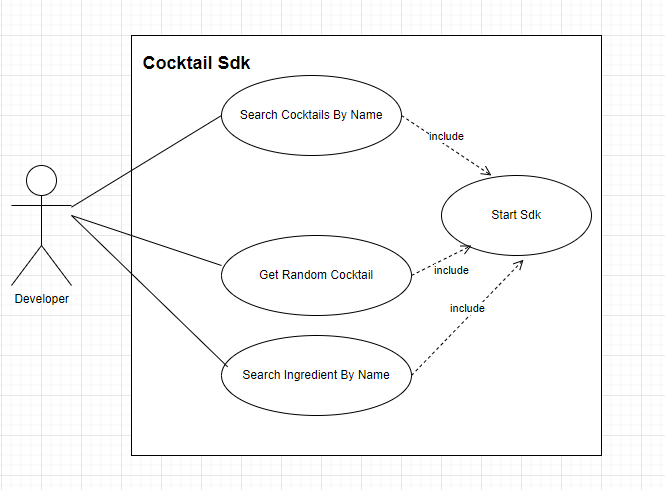
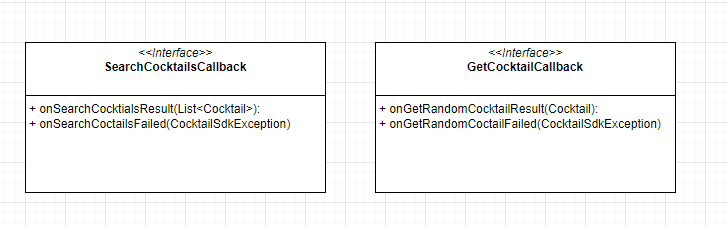
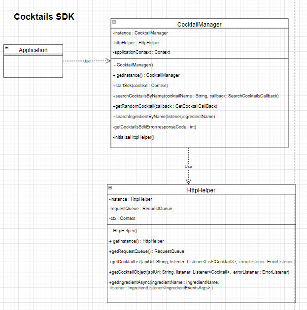

# Cocktails Sdk

## Structure
The cocktails sdk was written by using Java. For using cocktails sdk, the developer must include internet permission <kbd>uses-permission android:name="android.permission.INTERNET" /></kbd>into the andrid manifest file. For initializing cocktails sdk, the developer must call <kbd>startSdk</kbd> function. The user must provide application context as parameter of startSdk function. There is no need to initialize sdk again. Once it is initialized, the developer can use all functionalities. After initialized the sdk by calling the startSdk function, the developer can use  <kbd>searchCocktailsByName</kbd>, <kbd>getRandomCocktail</kbd>, <kbd>searchIngredientByName</kbd>.
```
CocktailManager.getInstance().startSdk(getApplicationContext());
```


## Callbacks 
There are two kinds of callbacks. One for searchCocktailsByName function, the other for getRandomCocktail function.


## Functions 
-searchCocktailsByName

```
  try {
                CocktailManager.getInstance().searchCocktailsByName("mojito", new SearchCocktailsCallback() {
                    @Override
                    public void onSearchCocktailsResult(List<Cocktail> cocktailList) {
                        adapter = new CocktailAdapter(view.getContext(), cocktailList);
                        cocktailListView.setAdapter(adapter);
                    }

                    @Override
                    public void onSearchCocktailsFailed(CocktailsSdkException exception) {
                        String message = exception.getErrorType().toString() + " " + exception.getMessage();
                        Toast.makeText(MainActivity.this, message, Toast.LENGTH_LONG).show();
                    }
                });
            }catch(Exception e){
                System.out.println(e.getMessage().toString());
                System.out.println(e.getStackTrace().toString());
            }
```
- getRandomCocktail
```
  CocktailManager.getInstance().getRandomCocktail(new GetCocktailCallback() {
                @Override
                public void onGetRandomCocktailResult(Cocktail cocktaiL) {
                   cocktailTextView.setText(cocktaiL.toString());
                }

                @Override
                public void onGetRandomCocktailFailed(CocktailsSdkException exception) {
                    String message = exception.getErrorType().toString() + " " + exception.getMessage();
                    Toast.makeText(MainActivity.this, message, Toast.LENGTH_LONG).show();
                }
            });
  ```
- searchIngredientByName
  ```
   CocktailManager.getInstance().searchIngredientByName(  this,"vodka");
  ```
## Overview with class diagram

